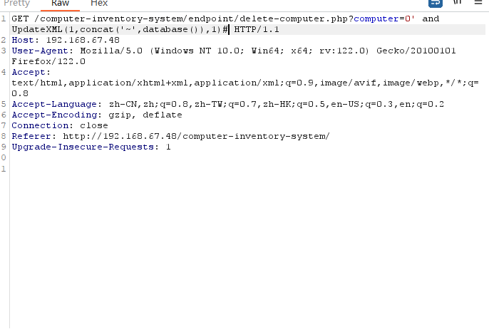
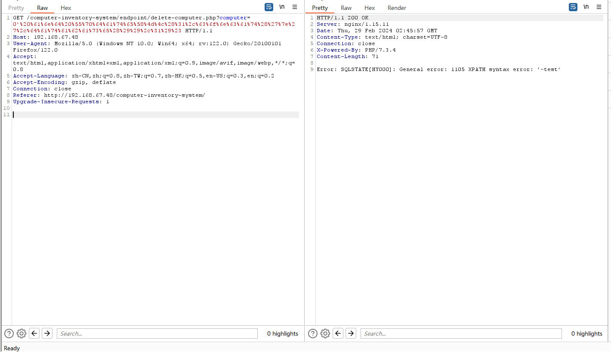

#Computer Inventory System SQL Injection
 
##Description
The system Client doesn't properly sanitise GET parameter, which  result into a SQL Injection.

#Vendor Homepage
https://www.sourcecodester.com/php/17165/computer-inventory-system-using-php-and-mysql-source-code.html
 
#Author
wenqin@webray.com.cn inc
 
#Proof of Concept
1.Click the delete button,and use burpsuite capture packets,the SQL Injection statement is 0' and UpdateXML(1,concat('~',database()),1)#.
 
2.Visiting the home page of the website will trigger the code
