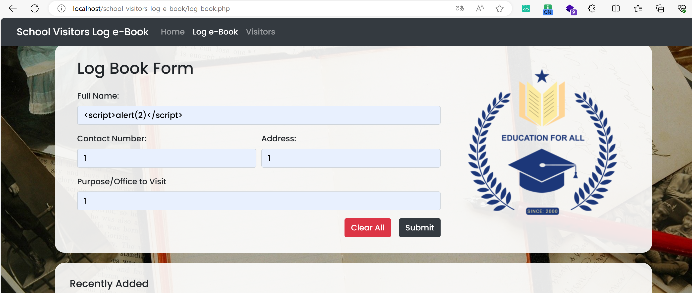
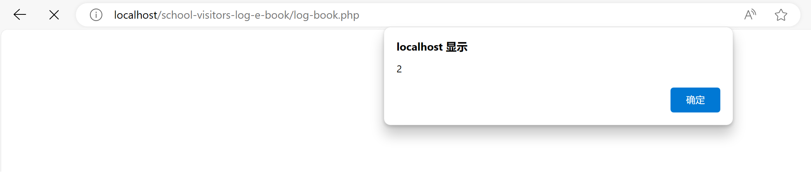

#School Visitor Log e-Book  Stored Cross-Site Scripting(XSS)
 
#Description
 
The system Client doesn't properly sanitise POST parameter, which result into a Stored Cross-Site Scripting(XSS).
 
#Vendor Homepage
 
https://www.sourcecodester.com/php/17022/school-visitor-log-e-book-using-php-and-mysql-source-code.html
 
#Author
 wenqin@webray.com.cn inc
#Proof of Concept
 
1.Open the website and enter payload at the input title
 
2.Visiting the home page of the website will trigger the code
