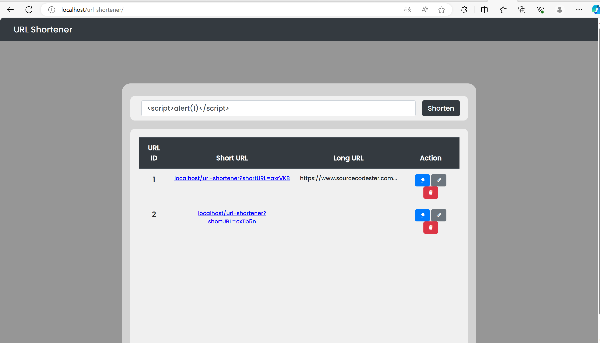
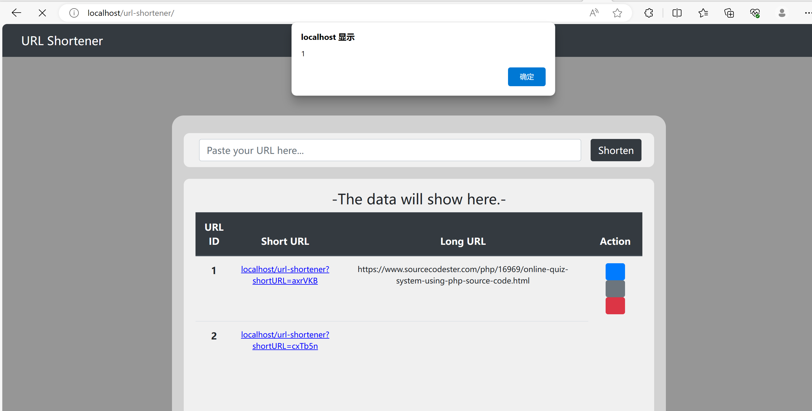

#URL Shortener Stored Cross-Site Scripting(XSS)
 
##Description
The system Client doesn't properly sanitise POST parameter, which  result into a Stored Cross-Site Scripting(XSS).

#Vendor Homepage
https://www.sourcecodester.com/php/16971/url-shortener-using-php-source-code.html
 
#Author
wenqin@webray.com.cn inc
 
#Proof of Concept
1.Open the website and enter payload at the input URL link
 
2.Visiting the home page of the website will trigger the code
